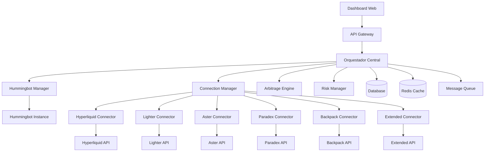

# Documento de Diseño - Conectividad DEX via Hummingbot

## Visión General

El sistema de conectividad DEX está diseñado como una arquitectura híbrida que combina las capacidades nativas de Hummingbot para trading automatizado con conectividad directa API/MCP para funcionalidades avanzadas específicas de cada exchange. La arquitectura sigue un patrón de microservicios distribuidos que permite escalabilidad, mantenibilidad y extensibilidad.

El diseño se basa en tres capas principales: una capa de conectividad que maneja las comunicaciones con exchanges, una capa de orquestación que coordina operaciones multi-exchange, y una capa de presentación que proporciona interfaces de usuario y APIs para integración externa.

## Arquitectura del Sistema

### Arquitectura de Alto Nivel



### Componentes Principales

#### 1. Orquestador Central
El orquestador central actúa como el cerebro del sistema, coordinando todas las operaciones entre los diferentes componentes. Implementa patrones de Event Sourcing y CQRS para manejar la complejidad de operaciones distribuidas y mantener consistencia de estado.

**Responsabilidades:**
- Coordinación de estrategias multi-exchange
- Gestión de estado global del sistema
- Routing inteligente de órdenes
- Sincronización de datos entre componentes
- Gestión de eventos y notificaciones

#### 2. Hummingbot Manager
Este componente encapsula y gestiona instancias de Hummingbot, proporcionando una interfaz programática para configuración, monitorización y control. Utiliza el patrón Adapter para abstraer las complejidades específicas de Hummingbot.

**Responsabilidades:**
- Instalación y configuración automatizada de Hummingbot
- Gestión del ciclo de vida de estrategias
- Monitorización de rendimiento y salud
- Integración con el sistema de logging centralizado
- Gestión de configuraciones por exchange

#### 3. Connection Manager
Gestiona todas las conexiones directas con APIs de exchanges, implementando patrones de Circuit Breaker y Retry para garantizar robustez. Cada connector específico implementa una interfaz común que permite operaciones uniformes independientemente del exchange subyacente.

**Responsabilidades:**
- Gestión de conexiones y autenticación
- Implementación de rate limiting y throttling
- Manejo de reconexiones automáticas
- Normalización de datos entre exchanges
- Gestión de websockets y streams de datos

#### 4. Arbitrage Engine
Motor especializado en detección y ejecución de oportunidades de arbitraje, utilizando algoritmos de optimización para maximizar rentabilidad mientras minimiza riesgo. Implementa modelos predictivos para estimar viabilidad de operaciones.

**Responsabilidades:**
- Detección en tiempo real de oportunidades
- Cálculo de viabilidad considerando todos los costos
- Ejecución coordinada de operaciones multi-exchange
- Análisis post-trade y optimización de parámetros
- Gestión de inventario para arbitraje

#### 5. Risk Manager
Sistema de gestión de riesgo que monitoriza continuamente exposiciones, implementa límites dinámicos y ejecuta acciones correctivas automáticas. Utiliza modelos de riesgo adaptativos que se ajustan a condiciones de mercado cambiantes.

**Responsabilidades:**
- Monitorización de exposiciones en tiempo real
- Implementación de límites de riesgo dinámicos
- Cálculo de métricas de riesgo (VaR, drawdown, etc.)
- Ejecución de acciones correctivas automáticas
- Análisis de correlaciones entre exchanges


## Exchanges

🟢 Hyperliquid 👉 https://app.hyperliquid.xyz/join/LME
Código manual: LME
🟢 Lighter 👉 https://app.lighter.xyz/
🟢 Paradex 👉 https://app.paradex.trade/r/LMECripto
🟢 Extended 👉 https://app.extended.exchange/join/LM...
🟢 Dexari 👉 https://dexari.com/join/LMECripto
🟢 Aster 👉 https://www.asterdex.com/en/referral/...

### Soporte API

Los siguientes tienen soporte oficial de API para integración y trading programático:

Hyperliquid: Ofrece una API pública completa con soporte REST y WebSocket, así como un SDK en Python y TypeScript para facilitar la interacción con la API. Permite gestionar órdenes, cuentas, transferencias, y más. Se requiere generar un API Key con fondos depositados para usarla.

Lighter: Cuenta con una API documentada y un cliente Python. Permite la gestión de subcuentas y claves API para firmar y autenticar solicitudes. Está diseñada para operaciones sobre contratos inteligentes y trading en la blockchain.

Paradex: Proporciona un SDK Python y acceso a una API REST y WebSocket JSON-RPC para obtener datos de mercado y gestionar órdenes. Requiere clave API para acceder a los endpoints tanto públicos como privados.

Extended: Tiene una API robusta con documentación pública que incluye REST y WebSocket para trading híbrido en contratos perpetuos con liquidación on-chain. También cuenta con SDKs y soporte para subcuentas, gestión de claves y órdenes. La autenticación usa clave API junto con firmas Stark para operaciones que involucran fondos.

Aster: Dispone de API que permite a los usuarios operar a través de claves API con control de permisos e incluye documentación para autenticación y operaciones. Es un DEX de contratos perpetuos que ofrece modo Pro y Simple, con un enfoque en privacidad y alta frecuencia.

Dexari: Aunque es una plataforma móvil para trading de perpetuos descentralizados basada en el orderbook de Hyperliquid, no hay evidencia clara o pública que indique soporte de API abierta para integración externa programática en la información disponible.

Paradex: Sí tiene API de tipo REST y WebSocket documentada para trading programático.

Dexari: No se encontró documentación pública que confirme soporte de API para trading programático.

Aster: Sí, proporciona una API para integración que permite crear y gestionar claves API y realizar operaciones en la plataforma.

En resumen, los DEX con soporte claro y oficial de API para trading son: Hyperliquid, Lighter, Paradex, Extended y Aster. Dexari no muestra soporte público de API para integración.


## Componentes y Interfaces

### Interfaces de Conectividad por Exchange

#### Hyperliquid Connector
```typescript
interface HyperliquidConnector {
  // Gestión de conexión
  connect(credentials: HyperliquidCredentials): Promise<ConnectionStatus>
  disconnect(): Promise<void>
  getConnectionStatus(): ConnectionStatus
  
  // Operaciones de trading
  placeOrder(order: PerpetualOrder): Promise<OrderResult>
  cancelOrder(orderId: string): Promise<CancelResult>
  getPositions(): Promise<Position[]>
  getOrderBook(symbol: string): Promise<OrderBook>
  
  // Funcionalidades específicas
  getLiquidityPools(): Promise<LiquidityPool[]>
  getMarginInfo(): Promise<MarginInfo>
  executeLeverageAdjustment(position: string, leverage: number): Promise<void>
}
```

#### Lighter Connector
```typescript
interface LighterConnector {
  // Gestión híbrida on-chain/off-chain
  connect(credentials: LighterCredentials): Promise<ConnectionStatus>
  setExecutionMode(mode: 'onchain' | 'offchain' | 'auto'): void
  
  // Operaciones de trading
  placeHybridOrder(order: HybridOrder): Promise<OrderResult>
  getAggregatedOrderBook(symbol: string): Promise<AggregatedOrderBook>
  
  // Funcionalidades específicas
  getArbitrageOpportunities(): Promise<ArbitrageOpportunity[]>
  monitorSettlement(orderId: string): Promise<SettlementStatus>
  getSpreadAnalysis(symbol: string): Promise<SpreadAnalysis>
}
```

#### Paradex Connector
```typescript
interface ParadexConnector {
  // Gestión institucional
  connect(credentials: ParadexCredentials): Promise<ConnectionStatus>
  
  // Trading de derivados
  placeDerivativeOrder(order: DerivativeOrder): Promise<OrderResult>
  createComplexStrategy(strategy: ComplexStrategy): Promise<StrategyResult>
  
  // Gestión de riesgo institucional
  calculateVaR(portfolio: Portfolio): Promise<VaRResult>
  performStressTest(scenarios: StressScenario[]): Promise<StressTestResult>
  getCorrelationAnalysis(): Promise<CorrelationMatrix>
}
```

### Interfaces de Orquestación

#### Strategy Orchestrator
```typescript
interface StrategyOrchestrator {
  // Gestión de estrategias multi-exchange
  createMultiExchangeStrategy(config: MultiExchangeConfig): Promise<Strategy>
  executeCoordinatedTrade(trade: CoordinatedTrade): Promise<ExecutionResult>
  
  // Optimización de ejecución
  optimizeOrderDistribution(order: LargeOrder): Promise<DistributionPlan>
  executeFragmentedOrder(plan: DistributionPlan): Promise<ExecutionResult[]>
  
  // Monitorización y control
  getStrategyPerformance(strategyId: string): Promise<PerformanceMetrics>
  pauseStrategy(strategyId: string): Promise<void>
  resumeStrategy(strategyId: string): Promise<void>
}
```

#### Liquidity Aggregator
```typescript
interface LiquidityAggregator {
  // Agregación de liquidez
  getAggregatedLiquidity(symbol: string): Promise<AggregatedLiquidity>
  calculatePriceImpact(order: Order): Promise<PriceImpactAnalysis>
  
  // Análisis de mercado
  getMarketDepthAnalysis(symbol: string): Promise<MarketDepthAnalysis>
  identifyLiquidityGaps(): Promise<LiquidityGap[]>
  
  // Recomendaciones
  recommendOptimalExecution(order: LargeOrder): Promise<ExecutionRecommendation>
  getArbitrageOpportunities(): Promise<ArbitrageOpportunity[]>
}
```

## Modelos de Datos

### Modelos de Trading

#### Order Model
```typescript
interface Order {
  id: string
  exchange: ExchangeType
  symbol: string
  side: 'buy' | 'sell'
  type: 'market' | 'limit' | 'stop' | 'stop_limit'
  quantity: number
  price?: number
  stopPrice?: number
  timeInForce: 'GTC' | 'IOC' | 'FOK'
  metadata: OrderMetadata
  timestamp: Date
  status: OrderStatus
}

interface OrderMetadata {
  strategyId?: string
  parentOrderId?: string
  executionMode: 'hummingbot' | 'direct_api'
  riskLimits: RiskLimits
  tags: string[]
}
```

#### Position Model
```typescript
interface Position {
  id: string
  exchange: ExchangeType
  symbol: string
  side: 'long' | 'short'
  size: number
  entryPrice: number
  currentPrice: number
  unrealizedPnL: number
  realizedPnL: number
  margin: number
  leverage: number
  liquidationPrice?: number
  timestamp: Date
}
```

### Modelos de Configuración

#### Exchange Configuration
```typescript
interface ExchangeConfig {
  exchange: ExchangeType
  enabled: boolean
  credentials: ExchangeCredentials
  connectionSettings: ConnectionSettings
  tradingSettings: TradingSettings
  riskSettings: RiskSettings
}

interface ConnectionSettings {
  apiUrl: string
  websocketUrl?: string
  timeout: number
  retryAttempts: number
  rateLimits: RateLimit[]
}

interface TradingSettings {
  defaultOrderSize: number
  maxOrderSize: number
  allowedOrderTypes: OrderType[]
  slippageTolerance: number
  executionMode: 'aggressive' | 'passive' | 'adaptive'
}
```

### Modelos de Análisis

#### Performance Metrics
```typescript
interface PerformanceMetrics {
  exchange: ExchangeType
  period: TimePeriod
  totalReturn: number
  sharpeRatio: number
  maxDrawdown: number
  winRate: number
  profitFactor: number
  averageTradeSize: number
  totalTrades: number
  totalFees: number
  latencyMetrics: LatencyMetrics
}

interface ArbitrageOpportunity {
  id: string
  buyExchange: ExchangeType
  sellExchange: ExchangeType
  symbol: string
  buyPrice: number
  sellPrice: number
  spread: number
  estimatedProfit: number
  requiredCapital: number
  estimatedExecutionTime: number
  riskScore: number
  viabilityScore: number
  timestamp: Date
}
```

## Gestión de Errores

### Estrategia de Error Handling

El sistema implementa una estrategia de gestión de errores en múltiples niveles:

#### Nivel de Conexión
- **Circuit Breaker Pattern**: Previene cascadas de fallos deshabilitando temporalmente conexiones problemáticas
- **Exponential Backoff**: Implementa delays progresivos para reconexiones
- **Health Checks**: Monitorización continua de la salud de conexiones

#### Nivel de Operación
- **Compensating Transactions**: Reversión automática de operaciones parcialmente completadas
- **Idempotency**: Garantiza que operaciones repetidas no causen efectos secundarios
- **Timeout Management**: Manejo inteligente de timeouts con escalación automática

#### Nivel de Sistema
- **Graceful Degradation**: Funcionalidad reducida cuando algunos componentes fallan
- **Failover Automático**: Redirección automática a exchanges alternativos
- **State Recovery**: Recuperación automática de estado después de fallos

### Clasificación de Errores

```typescript
enum ErrorType {
  CONNECTION_ERROR = 'connection_error',
  AUTHENTICATION_ERROR = 'authentication_error',
  RATE_LIMIT_ERROR = 'rate_limit_error',
  INSUFFICIENT_BALANCE = 'insufficient_balance',
  INVALID_ORDER = 'invalid_order',
  MARKET_CLOSED = 'market_closed',
  SYSTEM_ERROR = 'system_error'
}

interface ErrorResponse {
  type: ErrorType
  message: string
  exchange: ExchangeType
  timestamp: Date
  retryable: boolean
  suggestedAction: string
  metadata: any
}
```

## Estrategia de Testing

### Testing Unitario
- **Cobertura mínima**: 90% para componentes críticos
- **Mocking**: Simulación de APIs externas para testing aislado
- **Property-based testing**: Validación de invariantes del sistema

### Testing de Integración
- **Sandbox Testing**: Uso de entornos de prueba de exchanges
- **Contract Testing**: Validación de interfaces entre componentes
- **End-to-end Testing**: Flujos completos de trading simulado

### Testing de Rendimiento
- **Load Testing**: Simulación de cargas de trabajo realistas
- **Stress Testing**: Evaluación bajo condiciones extremas
- **Latency Testing**: Medición de tiempos de respuesta críticos

### Testing de Resiliencia
- **Chaos Engineering**: Inyección controlada de fallos
- **Network Partition Testing**: Simulación de problemas de conectividad
- **Recovery Testing**: Validación de procedimientos de recuperación

## Consideraciones de Seguridad

### Gestión de Credenciales
- **Hardware Security Modules (HSM)**: Almacenamiento seguro de claves privadas
- **Credential Rotation**: Rotación automática de credenciales
- **Least Privilege**: Permisos mínimos necesarios por componente

### Comunicaciones Seguras
- **TLS 1.3**: Cifrado de todas las comunicaciones externas
- **Certificate Pinning**: Validación estricta de certificados
- **API Key Management**: Gestión segura de claves de API

### Auditoría y Compliance
- **Audit Logging**: Registro detallado de todas las operaciones
- **Compliance Monitoring**: Verificación continua de cumplimiento regulatorio
- **Data Privacy**: Protección de datos sensibles según GDPR

### Monitorización de Seguridad
- **Anomaly Detection**: Detección de patrones de comportamiento anómalos
- **Intrusion Detection**: Monitorización de intentos de acceso no autorizado
- **Security Alerting**: Notificaciones inmediatas de eventos de seguridad

## Métricas y Monitorización

### Métricas de Rendimiento
- **Latencia de ejecución**: Tiempo desde decisión hasta ejecución
- **Throughput**: Número de operaciones por segundo
- **Success Rate**: Porcentaje de operaciones exitosas
- **Slippage**: Diferencia entre precio esperado y ejecutado

### Métricas de Negocio
- **ROI por exchange**: Retorno de inversión segmentado
- **Profit Factor**: Ratio de ganancias vs pérdidas
- **Sharpe Ratio**: Rendimiento ajustado por riesgo
- **Maximum Drawdown**: Pérdida máxima desde pico

### Métricas de Sistema
- **Uptime**: Disponibilidad del sistema
- **Error Rate**: Tasa de errores por componente
- **Resource Utilization**: Uso de CPU, memoria y red
- **Queue Depth**: Profundidad de colas de mensajes

### Alertas y Notificaciones
- **Alertas críticas**: Fallos de sistema, pérdidas significativas
- **Alertas de advertencia**: Degradación de rendimiento, límites de riesgo
- **Alertas informativas**: Oportunidades de arbitraje, cambios de configuración

El sistema de monitorización utiliza un stack moderno con Prometheus para métricas, Grafana para visualización, y AlertManager para gestión de alertas, proporcionando observabilidad completa del sistema.