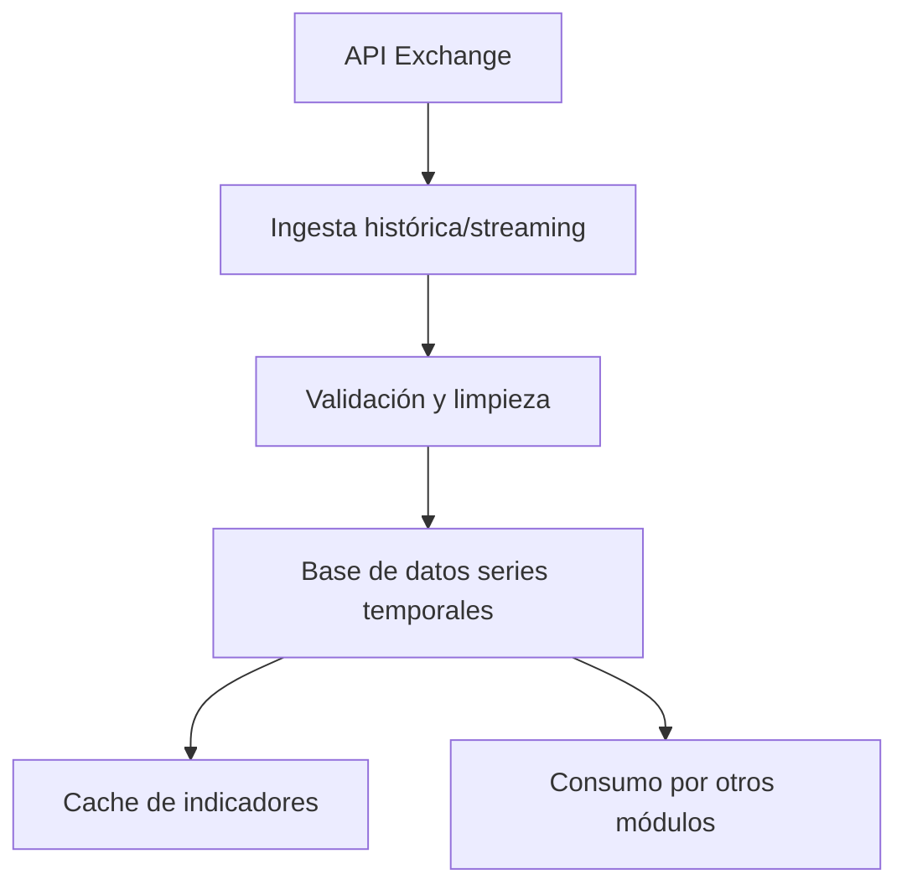

# Módulo 1: Ingesta y Almacenamiento de Datos

## Rol y objetivo
La función de este módulo es recolectar, validar, limpiar y almacenar datos de mercado (velas, volumen, indicadores) de forma eficiente y robusta, asegurando la calidad y disponibilidad para el resto de los módulos.

## Flujo de ingesta de datos
1. **Ingesta histórica (batch):**
   - Al iniciar o en job programado, consulta la base de datos para determinar el último timestamp almacenado.
   - Descarga solo las velas faltantes hasta el cierre de ayer desde la API del exchange.
   - Realiza bulk-insert y cálculo incremental de indicadores en la base de datos.
   - Aplica limpieza automática de datos antiguos (retención configurable, ej: 6 meses).
2. **Ingesta en tiempo real (streaming):**
   - Recoge velas en tiempo real vía WebSocket o REST.
   - Realiza UPSERT en la tabla de candles y actualiza la última vela con indicadores clave (ATR, VWAP, OBV, etc.).
   - Mantiene un cache local de las últimas N velas para lecturas rápidas.
3. **Validación y control de calidad:**
   - Verifica integridad de timestamps, duplicados y gaps.
   - Aplica reglas de limpieza y normalización de datos.
   - Registra errores y eventos para auditoría y alertas.

## Esquema de base de datos recomendado
- **TimescaleDB** o **QuestDB** como motor de series temporales.
- Tablas principales:
  - `candles`: OHLCV, exchange, par, timeframe, timestamp (PK), indicadores precomputados.
  - `indicators_cache`: últimos N valores de indicadores clave, actualizados en cada ingestión.
  - `metrics_summary`: métricas agregadas de corto plazo (media, std, percentiles, etc.).
- Uso de continuous aggregates, vistas materializadas o triggers para optimizar lecturas y cálculos.

## Estrategias de cache y optimización
- Mantener en memoria (o Redis) las últimas N velas e indicadores para acceso ultra-rápido.
- Actualizar solo la ventana móvil relevante en cada tick/vela.
- Garantizar consistencia con timestamps y lógica de invalidación al cerrarse cada nueva vela.

## Integración con otros módulos
- Provee datos limpios y validados al Módulo 2 (cálculo de indicadores) y al Módulo 3 (núcleo de tendencia).
- Permite acceso eficiente a históricos y datos en tiempo real para estrategias y monitorización.
- Expone API o interfaz de consulta para el resto del sistema.

## Extensibilidad y mejores prácticas
- Permitir la integración de nuevos exchanges, timeframes y tipos de datos (ordenes, trades, etc.).
- Diseñar el pipeline para ser desacoplado y fácilmente testeable.
- Documentar el esquema y los puntos de integración.
- Registrar todos los eventos y errores para trazabilidad.
- Automatizar la limpieza y validación periódica de datos.

## Ejemplo de flujo de ingesta y almacenamiento

---

Este módulo es crítico para la robustez y calidad de todo el sistema: una ingesta eficiente y validada es la base de cualquier estrategia de trading algorítmico.
