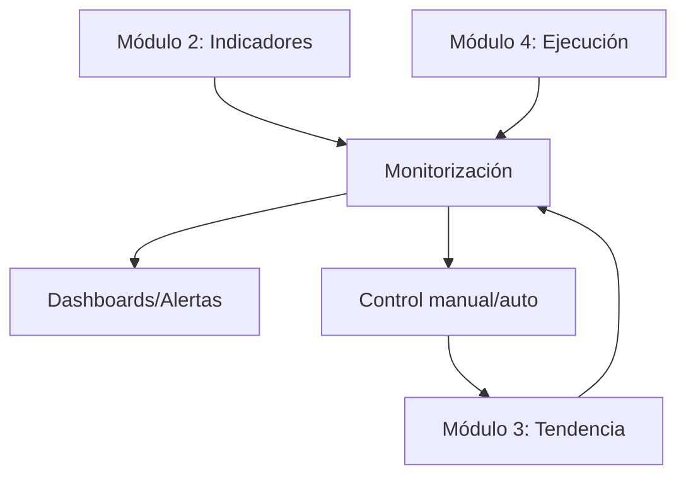

# Módulo 5: Monitorización, Control y Mejoras Operativas

## Rol y responsabilidades
Este módulo es el encargado de la observabilidad, auditoría y control operativo del sistema. Supervisa el funcionamiento de todos los módulos, registra eventos y métricas clave, genera alertas y reportes, y permite la intervención manual o automática ante situaciones críticas. Es fundamental para la resiliencia, trazabilidad y mejora continua del bot.

## Funciones clave
- Registro estructurado de todas las operaciones, decisiones y snapshots de indicadores.
- Análisis estadístico periódico y generación de reportes de desempeño y riesgo.
- Emisión de alertas multicanal (Telegram, Slack, Email) y visualización en dashboards (Grafana, Prometheus).
- Logs estructurados y visualización en tiempo real (Loki, ELK, Kibana).
- Interfaz de control (CLI, Bot de Telegram) para gestión, alertas y acciones manuales.
- Healthchecks, auto-restart y mecanismos de self-healing para asegurar la disponibilidad.

## Flujo de monitorización y control
1. **Captura de eventos**: Recibe datos, indicadores y decisiones de los módulos 2, 3 y 4.
2. **Registro y análisis**: Almacena logs, snapshots y resultados; ejecuta análisis estadístico y de riesgo.
3. **Alertas y dashboards**: Genera alertas ante eventos críticos y actualiza dashboards en tiempo real.
4. **Control y feedback**: Permite la intervención manual (pausas, cambios de modo) y, en casos críticos, puede enviar señales de control al núcleo (Módulo 3).
5. **Mejora operativa**: Ejecuta scripts de mantenimiento, validación y recuperación automática.

## Integración y dependencias
- **Entrada**: Recibe datos, indicadores y decisiones de los módulos 2 (Indicadores), 3 (Tendencia) y 4 (Ejecución).
- **Salida**: Informa al usuario, actualiza dashboards y, en casos especiales, puede accionar sobre el Módulo 3 (pausa, reoptimización, etc.).
- **Complementos**: Puede integrar módulos adicionales para descubrimiento de pares, validación de configuración y mantenimiento.

## Extensibilidad y mejores prácticas
- Permitir la integración de nuevos canales de alerta y visualización.
- Registrar todos los eventos y cambios para trazabilidad y auditoría.
- Diseñar el módulo para ser desacoplado y fácilmente ampliable.
- Documentar claramente los puntos de integración y los criterios de alerta/control.
- Facilitar la automatización de tareas de mantenimiento y recuperación.

## Ejemplo de arquitectura de monitorización

---

Este módulo es esencial para la robustez, transparencia y mejora continua del sistema, permitiendo detectar, analizar y actuar ante cualquier situación relevante en la operación del bot.
