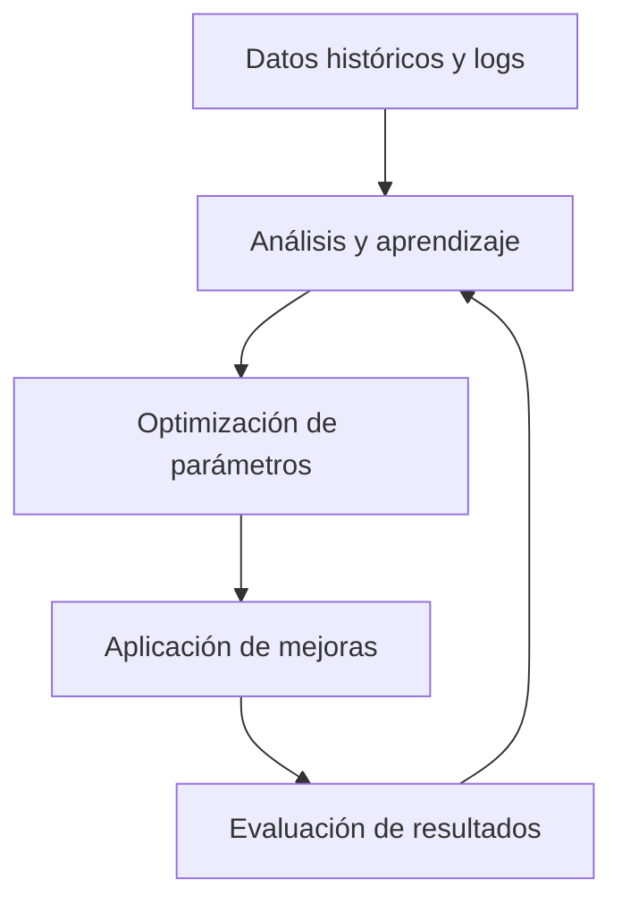

# Módulo 6: Aprendizaje, Optimización y Adaptabilidad

## Rol y propósito
Este módulo se encarga de la mejora continua del bot, integrando técnicas de aprendizaje automático, optimización de parámetros y adaptación dinámica a las condiciones cambiantes del mercado. Su objetivo es maximizar el rendimiento y la robustez del sistema a lo largo del tiempo.

## Funciones clave
- Analizar el desempeño histórico de estrategias y parámetros.
- Ejecutar procesos de optimización automática (por ejemplo, hyperopt, grid search, algoritmos evolutivos).
- Integrar modelos de aprendizaje supervisado o no supervisado para detectar patrones, anomalías o nuevas oportunidades.
- Recomendar o aplicar ajustes automáticos a las estrategias, reglas de gestión de riesgo y parámetros operativos.
- Evaluar el impacto de los cambios y registrar resultados para auditoría y mejora continua.

## Flujo de trabajo
1. **Recolección de datos**: Recibe datos históricos y resultados operativos de los módulos de monitorización y ejecución.
2. **Análisis y aprendizaje**: Aplica técnicas de análisis estadístico y machine learning para identificar oportunidades de mejora.
3. **Optimización**: Ejecuta procesos de ajuste de parámetros y selección de estrategias óptimas.
4. **Aplicación de mejoras**: Propone o implementa cambios en la configuración del bot, notificando a los módulos relevantes.
5. **Evaluación y feedback**: Mide el impacto de los cambios y retroalimenta el ciclo de aprendizaje.

## Integración y dependencias
- **Entrada**: Recibe datos de desempeño y logs de los módulos 4 (Ejecución) y 5 (Monitorización).
- **Salida**: Propone o aplica ajustes a los módulos 2 (Indicadores), 3 (Tendencia) y 4 (Estrategias).
- **Control**: Puede operar en modo automático (auto-optimización) o manual (sujeto a validación del usuario).

## Extensibilidad y mejores prácticas
- Permitir la integración de nuevos algoritmos de optimización y modelos de machine learning.
- Registrar todos los cambios y resultados para trazabilidad y auditoría.
- Diseñar el módulo para ser desacoplado y fácilmente testeable.
- Documentar claramente los puntos de integración y los criterios de éxito de las optimizaciones.

## Ejemplo de ciclo de optimización

---

Este módulo es clave para la evolución y adaptabilidad del bot, permitiendo que aprenda y mejore de forma continua frente a los desafíos del mercado.
